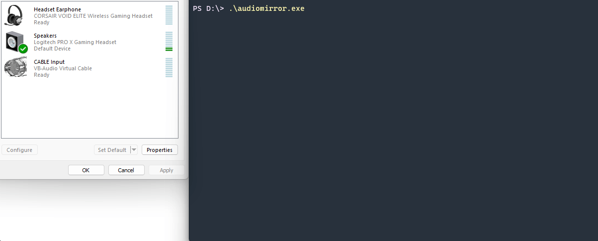

# AudioMirror.rs

This is a program that allows you to loop audio from one speaker to another. It is useful for testing the audio quality of speakers and headphones, quick changes of headsets, and other similar use cases.

Different sampple rates (like 48KHz with 96KHz) will not work, both speakers must have the same sample rate.

## Usage

1. Go to the [latest release](https://github.com/KallelGaNewk/audiomirror/releases/latest)
2. Download `audiomirror.exe`.
3. Double click the file or run it from the command line.
4. Follow the prompts to select your output and input speakers.
5. The program will loop audio from the output speaker to the input speaker.

## Build yourself

1. Install Rust and Cargo by following the instructions on the [official Rust website](https://www.rust-lang.org/tools/install).
2. Clone this repository to your local machine.
3. Navigate to the project directory in your terminal.
4. Connect two playback devices to your computer.
5. Run the program by running `cargo run --release` in your terminal.

## Known issues
- Upchanneling isn't a thing yet, stereo to surround has issues.

## Contributing

If you find any bugs or have any suggestions for improvements, feel free to open an issue or submit a pull request.

## License

This program is licensed under the [MIT License](https://opensource.org/licenses/MIT).
